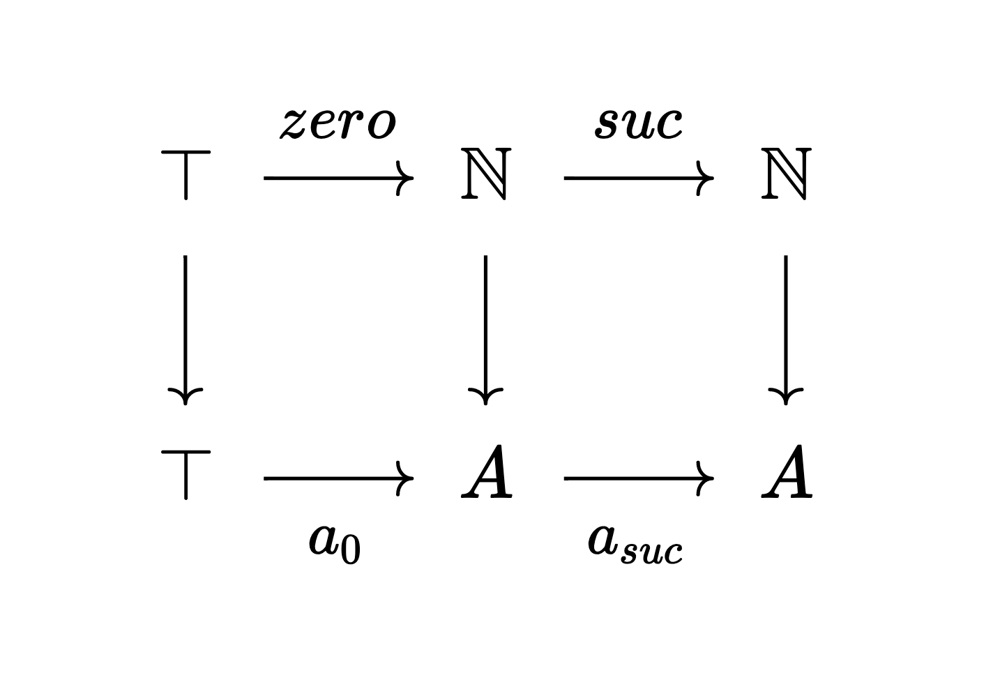

# Terms and Types

There are three ways of looking at `A : Type`.
  - proof theoretically, '`A` is a proposition'
  - type theoretically, '`A` is a construction'
  - categorically, '`A` is an object in category `Type`'

A first example of a type construction is the function type.
Given types `A : Type` and `B : Type`, 
we have another type `A → B : Type` which can be seen as
  - the proposition '`A` implies `B`'
  - the construction 'ways to convert `A` recipes to `B` recipes'
  - internal hom of the category `Type`

To give examples of this, let's make some types first!

## True / Unit / Terminal object

```agda 
data ⊤ : Type where
  tt : ⊤
```

It reads '`⊤` is an inductive type with a constructor `tt`',
with three interpretations
  - `⊤` is a proposition and there is a proof of it, called `tt`.
  - `⊤` is a construction with a recipe called `tt`
  - `⊤` is a terminal object: every object has a morphism into `⊤` given by `· ↦ tt`

In general, the expression `a : A` is read '`a` is a term of type `A`',
and has three interpretations,
  - `a` is a proof of the proposition `A`
  - `a` is a recipe for the construction `A`
  - `a` is a generalised element of the object `A` in the category `Type`.

The above tells you how we _make_ a term of type `⊤`.
Let's see an example of _using_ a term of type `⊤`:

```agda
TrueToTrue : ⊤ → ⊤
TrueToTrue = { }
```

- enter `C-c C-l` (this means `Ctrl-c Ctrl-l`).
  Whenever you do this, Agda will check the document is written correctly.
  This will open the `*Agda Information*` window looking like 
  
  ```
  ?0 : ⊤ → ⊤
  ?1 : ⊤
  ?2 : ⊤
  ```
  
  This says you have three unfilled holes.
- Now you can fill the hole `{ }0`.
- navigate to the hole `{ }` using `C-c C-f` (forward) or `C-c C-b` (backward)
- enter `C-c C-r`. The `r` stands for _refine_.
  Whenever you do this whilst having your cursor in a hole,
  Agda will try to help you. 
- you should see `λ x → { }`. This is agda's notation for `x ↦ { }` 
  and is called `λ` abstraction, think `λ` for 'let'.
- navigate to the new hole
- enter `C-c C-,` (this means `Ctrl-c Ctrl-comma`).
  Whenever you make this command whilst having your cursor in a hole, 
  Agda will check the _goal_. 
- the goal (`*Agda information*` window) should look like
  
  ```
  Goal: ⊤
  —————————————————————————
  x : ⊤
  ```
    
  you have a proof/recipe/generalized element `x : ⊤`
  and you need to give a proof/recipe/generalized element of `⊤`
- write the proof/recipe/generalized element `x` of `⊤` in the hole
- press `C-c C-SPC` to fill the hole with `x`.
  In general when you have some term (and your cursor) in a hole,
  doing `C-c C-SPC` will tell Agda to replace the hole with that term.
  Agda will give you an error if it can't make sense of your term.
- the `*Agda Information*` window should now only have two unfilled holes left,
  this means Agda has accepted your proof.
 
  ```
  ?1 : ⊤
  ?2 : ⊤
  ```

There is more than one proof (see solutions).
Here is an important one:

```agda
TrueToTrue' : ⊤ → ⊤
TrueToTrue' x = { }
```

  - Naviagate to the hole and check the goal.
  - Note `x` is already taken out for you.
  - You can try type `x` in the hole and `C-c C-c`
  - `c` stands for 'cases'. 
    Doing `C-c C-c` with `x` in the hole 
    tells agda to 'do cases on `x`'.
    The only case is `tt`.

One proof says for any term `x : ⊤` give `x` again.
The other says it suffices to do the case of `tt`,
for which we just give `tt`.

> Are these proofs 'the same'? What is 'the same'?

(This question is deep and should be unsettling.
Sneak peek: they are _internally_ but
not _externally_ 'the same'.)

Built into the definition of `⊤` is agda's way of making a map out of ⊤
into another type `A`, which we have just used.
It says 'to map out of `⊤` it suffices to do the case when `x` is `tt`', or
  - the only proof of `⊤` is `tt`
  - the only recipe for `⊤` is `tt`
  - the only one generalized element `tt` in `⊤`

Let's define another type.

## False / Empty / Initial object

```agda

data ⊥ : Type where

```

It reads '`⊥` is an inductive type with no constructors',
with three interepretations
  - `⊥` is a proposition with no proofs
  - `⊥` is a construction with no recipes
  - There are no generalized elements of `⊥` (it is a strict initial object)

Let's try mapping out of `⊥`.

```agda
explosion : ⊥ → ⊤
explosion x = { }
```

  - Navigate to the hole and do cases on `x`.

Agda knows that there are no cases so there is nothing to do!
This has three interpretations:
  - false implies anything (principle of explosion)
  - One can convert recipes of `⊥` to recipes of
    any other construction since
    there are no recipes of `⊥`.
  - `⊥` is initial in the category `Type`

## The natural numbers

We can also encode "natural numbers" as a type.

```agda
data ℕ : Type where
  zero : ℕ
  suc : ℕ → ℕ
```

As a construction, this reads :
  - `ℕ` is a type of construction
  - `zero` is a recipe for `ℕ`
  - `suc` takes an existing recipe for `ℕ` and gives
      another recipe for `ℕ`.

We can also see `ℕ` categorically :
ℕ is a natural numbers object in the category `Type`.
This means it is equipped with morphisms `zero : ⊤ → ℕ` 
and `suc : ℕ → ℕ` such that
given any `⊤ → A → A` there exist a unique morphism `ℕ → A`
such that the diagram commutes:


`ℕ` has no interpretation as a proposition since
there are 'too many proofs' -
mathematicians classically don't distinguish
between proofs of a single proposition.
(ZFC doesn't even mention logic internally,
unlike Type Theory!)

To see how to use terms of type `ℕ`, i.e. induction on `ℕ`, 
go to Quest1!

## Universes

You may have noticed the notational similarities between 
`zero : ℕ` and `ℕ : Type`.
This may have lead you to the question, `Type : ?`.
In type theory, we simply assert `Type : Type₁`.
But then we are chasing our tail, asking `Type₁ : Type₂`.
Type theorists make sure that every type 
(i.e. anything the right side of `:`)
itself is a term (i.e. anything on the left of `:`), 
and every term has a type.
So what we really need is 
```
Type : Type₁, Type₁ : Type₂, Type₂ : Type₃, ⋯
```
These are called _universes_.
The numberings of universes are called _levels_.
It will be crucial that types can be treated as terms.
This will allows us to
  - reason about '_structures_' such as 'the structure of a group',
    think 'for all groups'
  - do category theory without stepping out of the theory 
    (no need for classes etc. For experts, we have Grothendieck universes.)
  - reason about when two types are 'the same', 
    for example when are two definitions of
    the natural numbers 'the same'? What is 'the same'?

