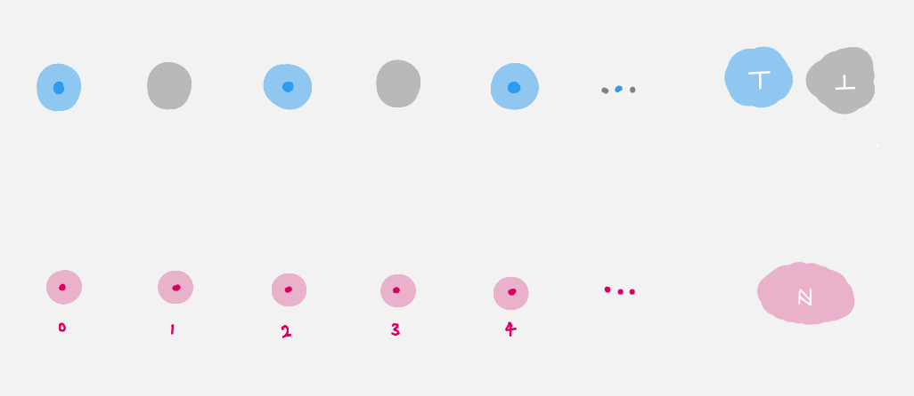
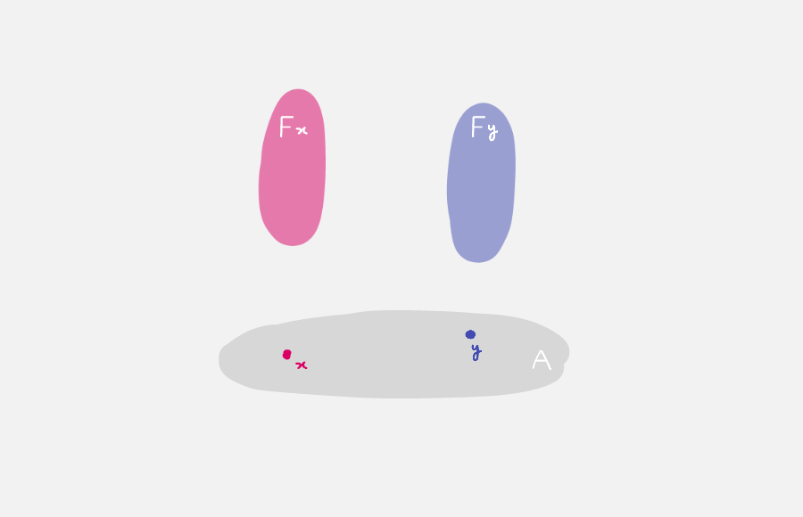

# Dependent Types

In a 'place to do maths'
we would like to be able to express and 'prove'
the statement

> There exists a natural that is even.

The goal of this quest is to define
"what it means for a natural to be even".

## Predicates / Dependent Constructions / Bundles

This requires the notion of a _predicate_.
In general a predicate on a type `A : Type` is 
a term of type `A → Type`. 
For example,

```agda
isEven : ℕ → Type
isEven n = ? 
```

- Do `C-c C-l` to load the file.
- Navigate to the hole.
- Input `n` in the hole and do `C-c C-c`.
  You should now see 
  
  ```agda
  
  isEven : ℕ → Type
  isEven zero = {!!}
  isEven (suc n) = {!!}

  ```
  It says "to define a function on `ℕ`,
  it suffices to define the function on the _cases_, 
  `zero` and `suc n`, 
  since these are the only constructors given 
  in the definition of `ℕ`."
  This has the following interpretations :
  
  - propositionally, this is the _principle of mathematical induction_.
  - categorically, this is the universal property of a
    natural numbers object.
    
- Navigate to the first hole and check the goal.
  You should see 
  ```
  Goal: Type
  ———————————
  ```
  Fill the hole with `⊤`, since we want `zero` to be even.
- Navigate to the second hole.
- Input `n` and do `C-c C-c` again.
  You should now see
  ```agda
  isEven : ℕ → Type
  isEven zero = ⊤
  isEven (suc zero) = {!!}
  isEven (suc (suc n)) = {!!} 
  ```
  We have just used induction again. 
- Navigate to the first hole and check the goal.
  Agda should be asking for a term of type `Type`,
  so fill the hole with `⊥`,
  since we don't want `suc zero` to be even.
- Navigate to the next hole and check the goal.
  You should see in the 'agda information' window,
  ```
  Goal: Type
  ——————————————
  n : ℕ
  ```
  We are in the 'inductive step',
  so we have access to the previous natural number.
- Fill the hole with `isEven n`,
  since we want `suc (suc n)` to be even _precisely when_
  `n` is even.
  
  The reason we have access to the term `isEven n` is again
  because we are in the 'inductive step'.
- There should now be nothing in the 'agda info' window.
  This means everything is working. 
  (Compare your `isEven` with our solutions in `Quest2Solutions.agda`.)

There are three interpretations of `isEven : ℕ → Type`.
- Already mentioned, `isEven` is a predicate on `ℕ`.
- `isEven` is a _dependent construction_.
  Specifically, `isEven n` is either `⊤` or `⊥` depending on `n : ℕ`.
- `isEven` is a _bundle over `ℕ`_,
  i.e. an object in the over-category `Type↓ℕ`.
  Pictorially, it looks like
  
  
     
  In the categorical perspective, for each `n : ℕ`
  `isEven n` is called the _fiber over `n`_.
  In this particular example the fibers are either empty
  or singleton.

In general given a type `A : Type`, 
a _dependent type `F` over `A`_ is a term `F : A → Type`.
This should be drawn as a collection of space parameterised 
by the space `A`.

  
 
You can check if `2` is even by asking agda to 'reduce' the term `isEven 2`:
do `C-c C-n` (`n` for normalize) and type in `isEven 2`.
(By the way you can write in numerals since we are now secretly 
using `ℕ` from the cubical agda library.)

## Using the Trinitarianism

We introduced new ideas through all three perspectives,
as each has their own advantage

- Types as propositions is often the most familiar perspective,
  and hence can offer guidance for the other two perspectives.
  However the current mathematical paradigm uses proof irrelevance
  (two proofs of the same proposition are always 'the same'),
  which is _not_ compatible with HoTT.
- Types as constructions conveys the way in which 'data' is important,
  and should be preserved.
- Types as objects allows us to draw pictures, 
  thus guiding us through the syntax with geometric intuition.

For each new idea introduced, 
make sure to justify it proof theoretically, type theoretically and 
categorically.
