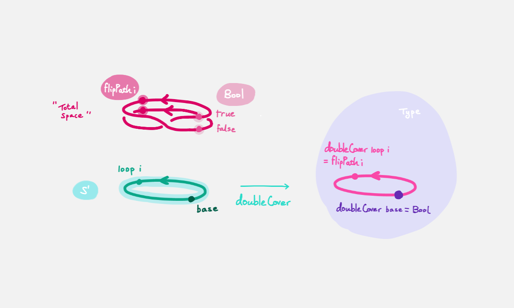
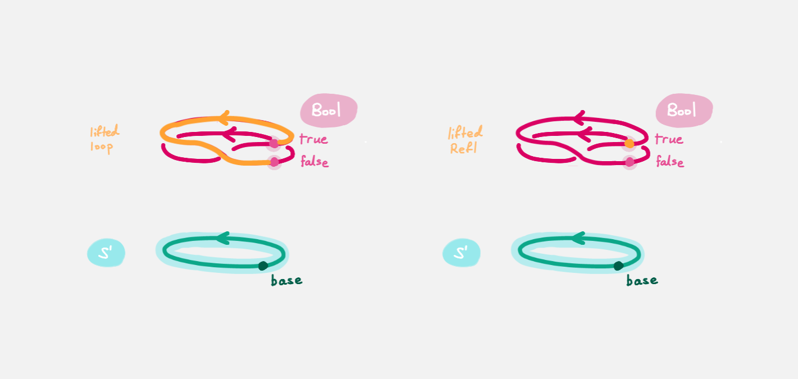

# `Refl ≡ loop` is empty

To get a better feel of `S¹`, we show that the space of paths (homotopies) between
`Refl` and `loop`, written `Refl ≡ loop`, is empty. 
First, we define the empty space and what it means for a space to be empty.
Here is what this looks like in `agda` :

```agda
data ⊥ : Type where 
```

This says "the empty space `⊥` is a space with no points in it".

Here are three candidate definitions for a space `A` to be empty :

- there is a point `f : A → ⊥` in the space of functions from `A` to the empty space
- there is a path `p : A ≡ ⊥` in the space of spaces `Type` from `A` to the empty space
- there is an isomorphism `i : A ≅ ⊥` of spaces

These turn out to be 'the same' (see `1FundamentalGroup/Quest0SideQuests/SideQuest0`),
however for our present purposes we will use the first definition.
Our goal is therefore to produce a point in the function space 

```agda
( Refl ≡ loop ) → ⊥
```

The authors of this series have thought long and hard
about how one would come up with the following argument.
Unfortunately, sometimes mathematics is in need of a new trick
and this was one of them.

> The trick is to make a path `p : true ≡ false` from the assumed path (homotopy) `h : Refl ≡ loop` by
> constructing a non-trivial `Bool`-bundle over the circle, 
> hence obtaining a map `( Refl ≡ loop ) → ⊥`.

To elaborate : 
`Bool` here refers to the discrete space with two points `true, false`.
(To find out the definition of `Bool` in `agda` 
you can hover over `Bool` in `agda` and use `M-SPC c d`.)
We will create a map `doubleCover : S¹ → Type` that sends
`base` to `Bool` and the path `loop` to a non-trivial path `flipPath : Bool ≡ Bool`
in the space of spaces.



Viewing the picture vertically,
for each point `x : S¹`, 
we call `doubleCover x` the _fiber of `doubleCover` over `x`_.
All the fibers look like `Bool`, hence our choice of the name _`Bool`-bundle_.

We will get a path from `true` to `false` 
in the fiber of `doubleCover` over `base`
by 'lifting the homotopy' `h : Refl ≡ loop` and considering the end points of 
the 'lifted paths'.
`Refl` will 'lift' to a 'constant path' and `loop` will 'lift' to 



Let's assume for the moment that we have `flipPath` already and
define `doubleCover`.

- Navigate to the definition of `doubleCover` and make sure
  you have loaded the file with `C-c C-l`.
  ```agda
  doubleCover : S¹ → Type
  doubleCover x = {!!}
  ```
- Navigate your cursor to the hole,
  write `x` and do `C-c C-c`.
  The `c` stands for _cases_.
  You should now see two new holes : 
  
  ```agda
  doubleCover : S¹ → Type
  doubleCover base = {!!}
  doubleCover (loop i) = {!!} 
  ``` 

  This means :
  `S¹` is made from a point `base` and an edge `loop`,
  so a map out of `S¹` to a space is the same as choosing
  a point and an edge to map `base` and `loop` to respectively.
  Since `loop` is a path from `base` to itself,
  its image must also be a path from the image of `base` to itself.
- Use `C-c C-f` and/or `C-c C-b` to navigate to the first hole.
  We want to map `base` to `Bool` so
  fill the hole with `Bool` using `C-c C-SPC`.
- Navigate to the second hole.
  Here `loop i` is a generic point in the path `loop`, 
  where `i : I` is a generic point of the 'unit interval'.
  We want to map `loop` to `flipPath`,
  so `loop i` should map to a generic point in the path `flipPath`. 
  Try filling the hole.
- Once you think you are done, reload the `agda` file with `C-c C-l`
  and if it doesn't complain this means there are no problems with your definition.

Defining `flipPath` is quite involved and we will do so in the next quest!
