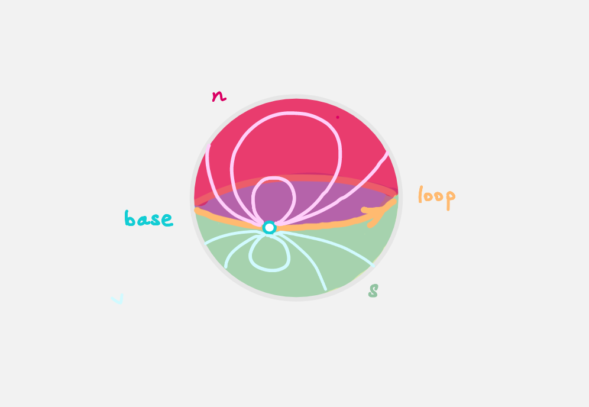

# Homotopy Levels

The loop space can contain higher homotopical information that
the fundamental group does not capture.
For example, consider `S²`.

```agda
data S² : Type where
  base : S²
  loop : base ≡ base
  northHemisphere : loop ≡ refl
  southHemisphere : refl ≡ loop
```

<p>
<details>
<summary>What is `refl`?</summary>

For any space `A` and point `a : A`, 
`refl` is the constant path at `a`.
Technically speaking, we should write `refl a` to indicate the point we are at,
however `agda` is often smart enough to figure that out.
</details>
</p>

Intuitively, all loops in `S²` based at `base` is homotopic to 
the constant path `refl`.
In other words, the fundamental group at `base` of `S²` is trivial.
However, the 'composition' of the path `southHemisphere` with `northHemisphere`
in `base ≡ base` gives the surface of `S²`,
which intuitively is not homotopic to the constant point `base`.
So `base ≡ base` has non-trivial path structure.



Let's be more precise about homotopical data : 
We can check that a space is 'homotopically trivial' (h-trivial) 
from dimension `n`
by checking if spheres of dimension `n` can be filled.
To be h-trivial from `0` is for any two points
to have a line in between; to fill `S⁰`. 
This data is captured in 

```agda
isProp : Type → Type 
isProp A = (x y : A) → x ≡ y
```

<p>
<details>
<summary>All maps are continuous in HoTT</summary>

There is a subtlety in the definition `isProp`.
This is _stronger_ than saying that the space `A` is path connected.
Since `A` is equipped with a continuous map taking pairs `x y : A`
to a path between them. 

We will show that `isProp S¹` is _empty_ despite `S¹` being path connected. 

</details>
</p>

Similarly, to be h-trivial from dimension `1` is for any two points `x y : A`
and any two paths `p q : x ≡ y` to have a homotopy from `p` to `q`;
to fill `S¹`. This is captured in

```agda
isSet : Type → Type
isSet A = (x y : A) → isProp (x ≡ y)
```

To define the fundamental group we will make the loop space satisfy
`isSet` by _trucating_ the loop space'.
First we show that `isProp S¹` and `isSet S¹` are both empty.
Locate `¬isSetS¹` in `1FundamentalGroup/Quest1.agda`.
In the cubical library we have the result 

```agda 
isProp→isSet : (A : Type) → isProp A → isSet A
```

which we will not prove.
Assuming `¬isSetS¹`, use `isProp→isSet` to deduce `¬isPropS¹`.
<!-- from now you should fill in the hypotheses of the proof yourself -->
<!-- (put `h` before the `=` sign or use `C-c C-r`).  -->

<p>
<details>
<summary>HLevel</summary>

Generalisation to HLevel and isHLevel n → isHLevel suc n??

</details>
</p>

Turning our attention to `¬isSetS¹`,
again given `h : isSet S¹` -
a map continuously taking each pair `x y : A` 
to a point in `isProp (x ≡ y)`.
We can apply `h` twice to the only point `base` available to us,
obtaining a point of `isProp (base ≡ base)`.
Try mapping from this into the empty space.

<p>
<details>
<summary>Hint 0</summary>

We have already shown that `Refl ≡ loop` is the empty space.
We have imported `Quest0Solutions.agda` for you, 
so you can just quote the result from there.

</details>
</p>

<p>
<details>
<summary>Hint 1</summary>

- assume `h`
- type `Refl≢loop` it in the hole and refine
- it should now be asking for a proof that `Refl ≡ loop`
- try to use `h`

</details>
</p>

