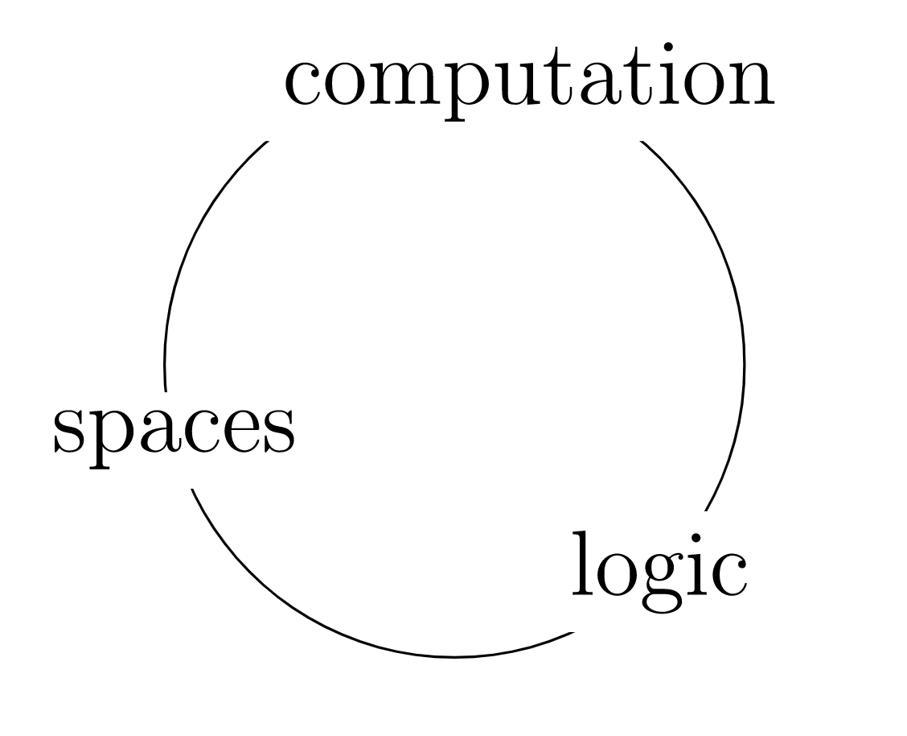

Trinitarianism
==============
By the end of this arc we will have 'a place to do maths'. 
The 'types' that will populated this 'place' 
will have three interpretations:
 - Proof theoretically, with types as propositions
 - Type theoretically, with types as programs
 - Category theoretically, with types as objects in a category

 
## Terms and Types

Here are some things that we could like to have in a 'place to do maths'
  - objects to reason about (like ℕ)
  - recipes for making things inside objects (like + 1)
  - propositions to reason with (with the data of proofs) (like _ = 0)

In proof theory, types are propositions and terms of a type are their proofs.
In type theory, types are programs and terms are algorithms.
In category theory, types are objects and terms are generalised elements.

## Non-dependent Types

- false / empty / initial object
- true / unit / terminal object
- or / sum / coproduct
- and / pairs / product
- implication / functions / internal hom

## Dependent Types

- predicate / type family / over category
- substitution / substitution / pullback
- existence / Σ type / left adjoint to pullback 
- for all / Π type / right adjoint to pullback

> Question: how do we talk about equality?
